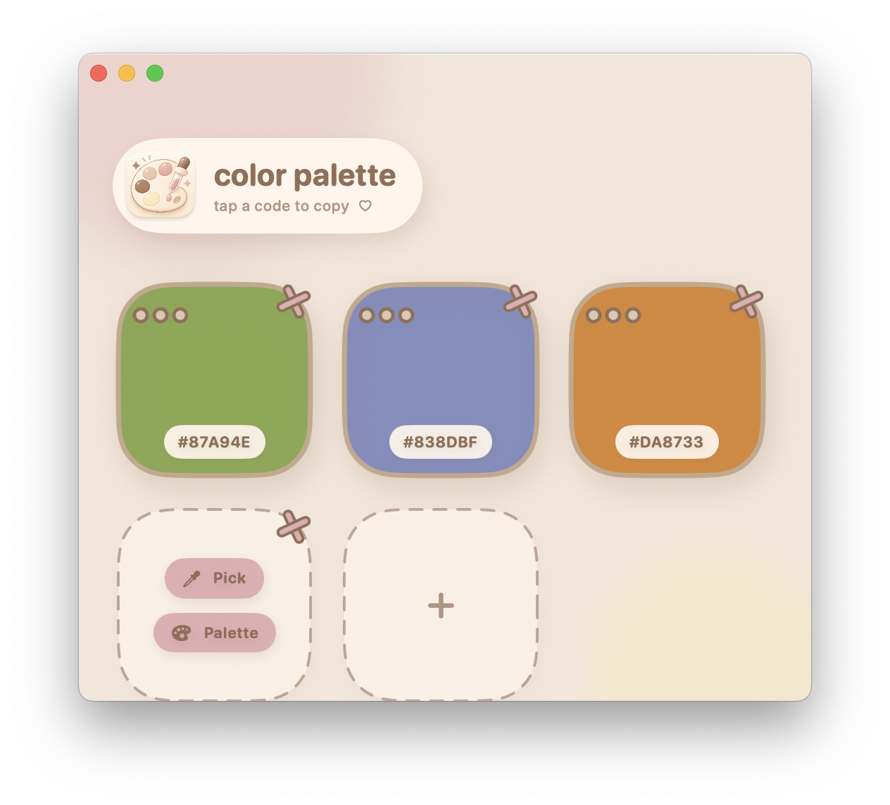

# Color Palette

A cute macOS color picker built with Swift and SwiftUI. Sample colors from the screen or the system palette, save them in a grid, and copy HEX with one click.



## Features

| Action | What it does |
|--------|----------------|
| **Pick** | Opens the system eyedropper (`NSColorSampler`) so you can click any pixel on screen |
| **Palette** | Opens the macOS color panel; changes save as you pick |
| **Tap HEX** | Copies the code to the clipboard |
| **⋯ menu** | Pick again, choose a color, copy HEX, or clear a filled slot |
| **＋** | Adds a new empty slot |
| **✕** | Deletes a slot (at least one slot always remains) |
| **Relaunch** | Slot count and colors restore from local JSON |

## Run from Xcode

1. Open `ColorPalette.xcodeproj` in Xcode.
2. Select the **ColorPalette** target and **My Mac**.
3. Press **⌘R**.

The first time you use **Pick**, macOS may ask for **Screen Recording** permission:

**System Settings → Privacy & Security → Screen Recording → enable ColorPalette**

## Use it without opening Xcode every time

After a successful build, copy `ColorPalette.app` from Xcode’s build folder into **Applications**.

In Xcode: **Products → ColorPalette.app → Show in Finder**.

Typical Debug path:

```text
~/Library/Developer/Xcode/DerivedData/ColorPalette-*/Build/Products/Debug/ColorPalette.app
```

## Requirements

- macOS 14.0+
- Xcode 15+
- Swift 5.9+

## Tech

- SwiftUI + `@Observable` for app state
- `NSColorSampler` for screen picking
- `NSColorPanel` for the system palette
- JSON persistence at `~/Library/Application Support/ColorPalette/palette.json`

## Project layout

```text
ColorPalette/
├── ColorPaletteApp.swift          App entry
├── Models/PaletteSlot.swift       Slot + HEX color model
├── Store/PaletteStore.swift       State and clipboard
├── Services/
│   ├── PalettePersistence.swift   Load / save JSON
│   ├── EyedropperService.swift    Screen eyedropper
│   └── ColorPanelService.swift    System color panel
└── Views/
    ├── ContentView.swift          Window, theme, header
    ├── SlotView.swift             One color slot
    └── AddSlotButton.swift        Add-slot tile
```

Lines marked `// LEARN:` explain Swift syntax if you are coming from another language.

## License

Personal project. The app icon and logo artwork are not licensed for reuse unless you add a license later.
